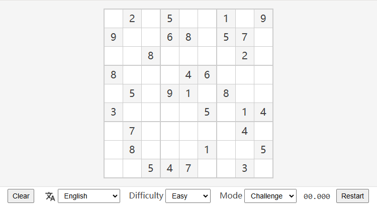

# Sudoku

- [中文 README](./README.zh-CN.md)

Sudoku is a logic-based, combinatorial number-placement puzzle. In classic Sudoku, the objective is to fill a 9 × 9 grid with digits so that each column, each row, and each of the nine 3 × 3 subgrids that compose the grid (also called "boxes", "blocks", or "regions") contains all of the digits from 1 to 9.

- [Sudoku game page](https://huangbuyi.github.io/sudoku/dist/)

## Features

- Sudoku creation
- Difficuty select
- Hints in *Casual* mode
- High accuracy timer in *Challenge* mode
- Conflicts indication